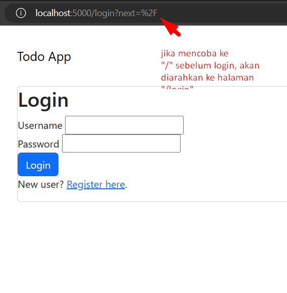
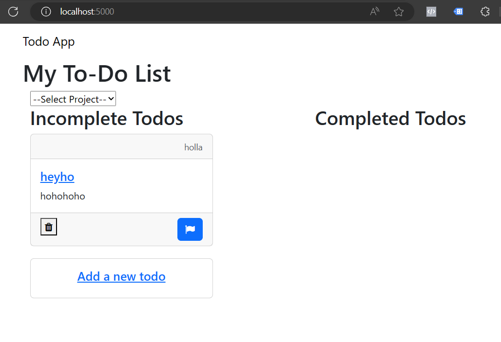
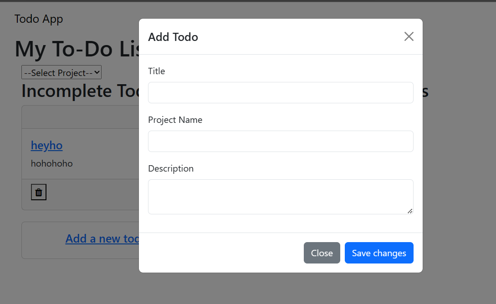
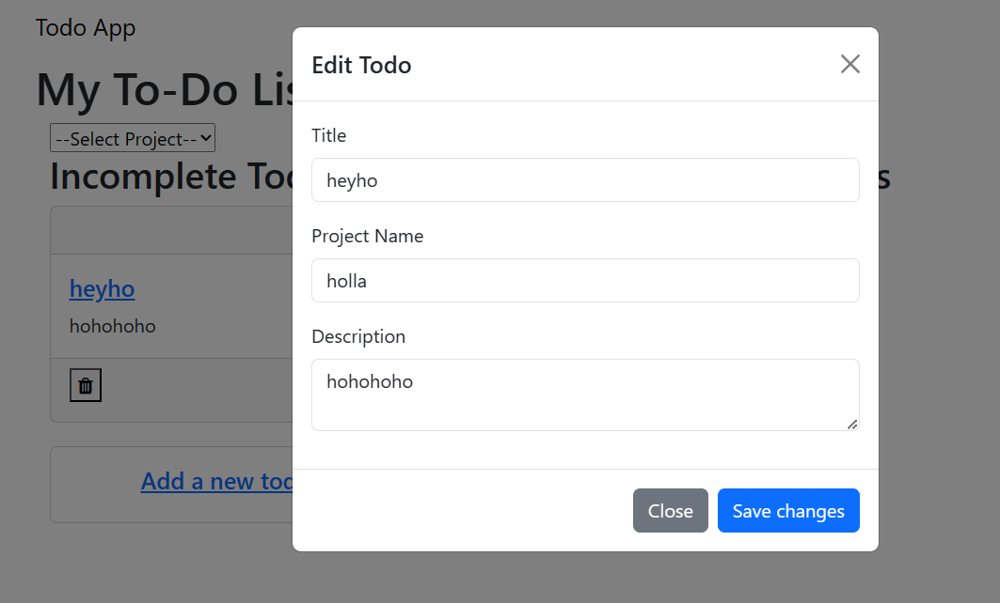
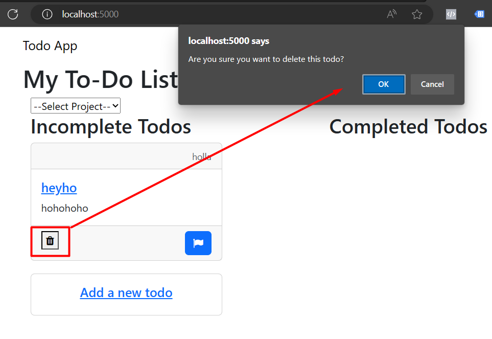
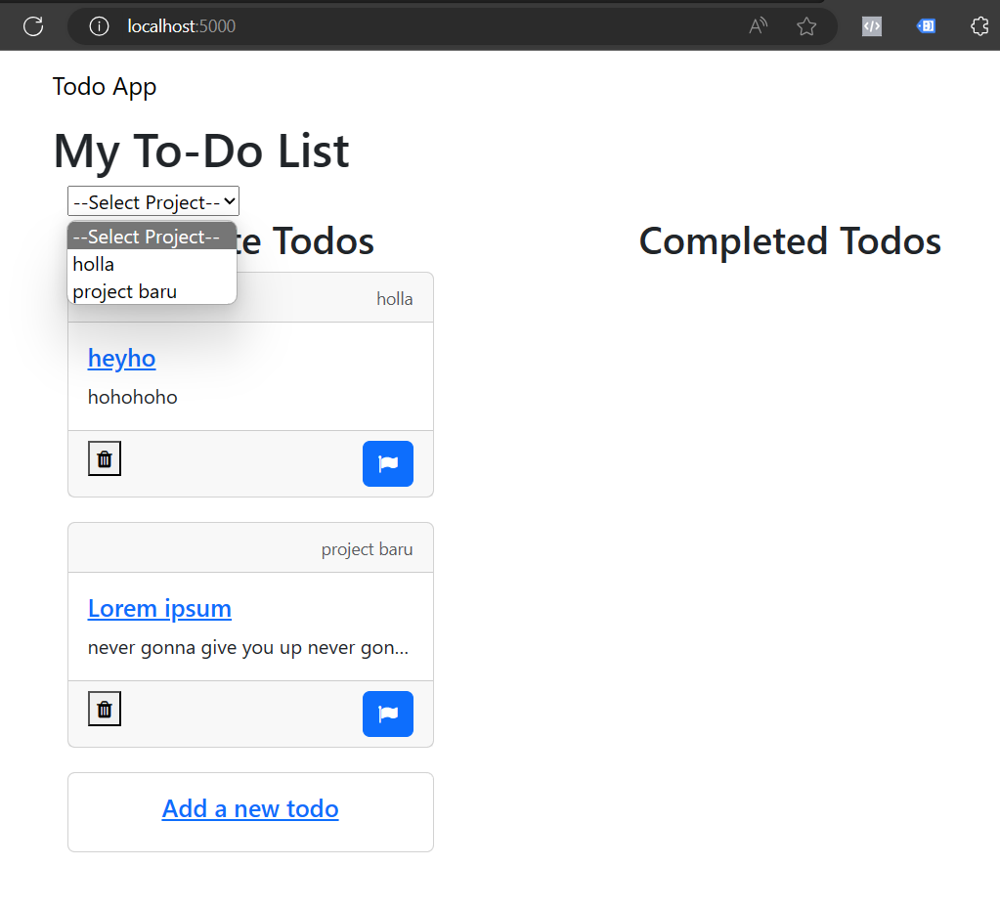
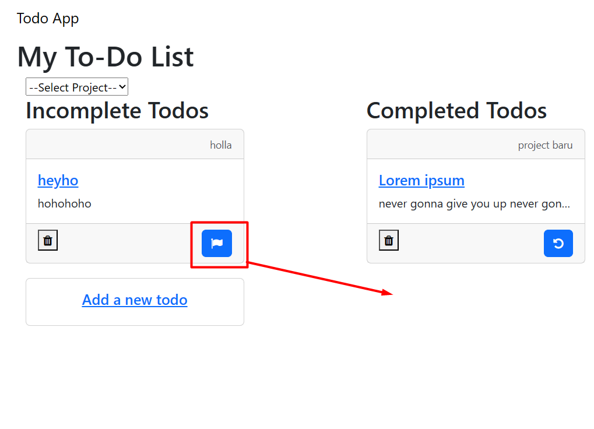

# Dua proyek jadi satu
Satu README.md ini akan menjelaskan project dari dua kelas Pacmann sekaligus, yaitu berkaitan tentang [Web Development](#webdev) dan [Linux & Container](#linux).

<h1 id="webdev">Web Development</h1>

## Latar Belakang
Web app todo dengan autentikasi pengguna berbasis Flask dan PostgreSQL. Todo berisi judul, deskripsi, dan nama proyek.

## Kebutuhan
### Fitur login
Jika tidak login, tidak dapat mengakses aplikasi.


### Daftar todo
Dapat melihat daftar todo yang belum selesai dan sudah selesai.


### Add & edit
Dapat menambah dan menyunting todo.



### Delete
Dapat menghapus sebuah todo.


### Filter
Dapat menyaring berdasarkan nama project.


### Update
Dapat menandakan selesai/tidak sebuah todo.


## Alur kode
Aplikasi Flask dijalankan pertama pada file `run.py` yang kemudian menginisiasikan file `todoapp/__init__.py`. Seluruh kode terkait aplikasi ada di dalam folder `todoapp`.

### `__init__.py`
Di file ini dapat kita lihat bahwa aplikasi ini berbasis Flask dan SQLAlchemy yang kita set di environment menggunakan database PostgreSQL.

Ada 2 blueprint yang digunakan. Blueprint `main` untuk fungsi utama aplikasi. Blueprint `auth` untuk keperluan autentikasi (login).

### `models.py`
Ini menjadi kode utama ORM (object-relational mapping), penghubung antara `class` di Python dengan database. Kita sebut sebagai `model`. Ada 2 model, yang menjadi tabel di dalam SQL, yaitu `Todo` dan `User`. Keduanya menggunakan mixin dari `db.Model` yang sudah didefinisikan oleh Flask.

#### `class User`
Digunakan untuk autentikasi. User memasukkan id, username, email, dan password. Password di model ini diproses dengan hashing, sehingga jika terjadi kebocoran database, tidak mudah diidentifikasi password-nya.

Proses hashing dilakukan lewat library `werkzeug.security` dengan function `generate_password_hash` untuk mengubah password menjadi hash saat dimasukkan. Lalu `check_passsword_hash` untuk mencocokkan percobaan memasukkan password.

Digunakan Mixin `UserMixin` dari library `flask_login` untuk memberikan fungsi login pada model ini.

#### `class Todo`
Diberi penghubung (foreign key) dengan class user lewat `user_id`. Supaya tiap user yang login hanya dapat melihat dan memodifikasi daftar Todo miliknya sendiri.

Sisanya adalah field-field yang dibutuhkan oleh Todo, seperti `title, description, project_name` dalam bentuk `String`. Sementara `complete` dalam bnetuk `Boolean` (`True`/`False`, apakah tugas selesai/tidak). Sementara `id` dan `user_id` sebagai integer. Primary key disematkan pada `id`.

### `routes.py`
Singkat kata, `routes` ini adalah untuk mengatasi jika user mencoba membuka URL tertentu atau mau melakukan aktivitas tertentu. Kita menggunakan beberapa decorator dari library yang ada di sini untuk membantu kita menjalankan fungsi-fungsi umum.

#### `index()`
Fungsi ini untuk menampilkan seluruh `Todo` yang dibuat oleh user yang sudah login (`@login_required`) di halaman utama `/`. Pertama kita ambil dulu daftar `project_name` yang ada di table `Todo` dan membuat daftarnya untuk menjadi penentu filter.

Fungsi ini menyediakan variabel `completed_todos, incomplete_todos, project_name, projects` untuk template `index.html`. 

#### `add()`
Fungsi ini dapat dipanggil jika user mengakses URL `/add`. Dan dengan metode `POST` akan membuat server bisa menerima data, sebagai `Todo` yang akan ditambahkan ke dalam database.

Karenanya fungsi ini meminta `title, project_name, description` sebagai `Todo` baru untuk di-commit ke dalam database. Setelah penambahan, user akan diarahkan kembali ke halaman utama `redirect(url_for('main.index'))`.

#### `edit(id)`
Dengan URL berbentuk `edit/<int:id>` dan metode `POST`, user dapat mengedit `Todo` yang sudah ada, bagian `title` dan `description` saja. Setelah selesai, akan di-redirect kembali ke halaman utama.

#### `update(id)`
Ini untuk meng-update `Todo` ber`id` tertentu agar ditandai sebagai `Todo` yang sudah selesai (jika sebelumnya belum selesai/incomplete). Tapi kebalikannya, jika `Todo` sudah selesai dipanggil `/update/<int:id>` maka akan ditandai sebagai incomplete.

#### `delete(id)`
Untuk menghapus `Todo` ber`id` tertentu dengan rute `/delete/<int:id>`.

#### `register(), login(), logout()`
Fungsi-fungsi ini berkaitan dengan fitur autentikasi dan berada di Blueprint `auth` dengan rute masing-masing. Untuk `register()` dan `login()` menggunakan template `register.html` dan `login.html`

Fungsi `register` dan `login` juga menggunakan `Form` yang didefinisikan di `forms.py`.

### `forms.py`
Untuk file ini kita gunakan Mixin `FlaskForm` dari library `flask_wtf`. Digunakan juga `wtforms` untuk mempermudah penentuan jenis Field pada masing-masing isian form, apakah berupa `StringField`, `PasswordField` dan seterusnya.

Digunakan juga `wtforms.validators` untuk memvalidasi apakah isian tersebut cocok dengan tipe `Field` yang diatur.

Ada 2 form di sini yaitu `RegistrationForm` dan `LoginForm` untuk digunakan oleh fungsi `register()` dan `login()` di `routes.py` dengan field yang disesuaikan dengan yang ada di `models.py`.

### `templates`
Folder ini berisi beberapa template parsial, namun dengan `base.html` sebagai induknya, di mana bagian `base.html` akan selalu dimuat untuk setiap template lain yang meng`` sebagai ``

Template utama ada:
- `base.html`
- `index.html`
- `login.html`
- `register.html`

Sementara file `html` lain merupakan bagian-bagian kecil saja yang bisa dipakai di dalam template-template di atas.

Contoh di `index.html` ada pengulangan sesuai jumlah Todo yang ada, kita masukkan dalam template dengan cara berikut:
```



```
Perhatikan bagian `todo_card.html` yang dimuat berulang menggunakan loop `for`.

### `static`
Sementara folder ini hanya memuat folder `css` untuk menampung file `style.css` yang dimuat oleh `base.html`. Folder `static` ini tidak berhubungan langsung  dengan `models` atau `routes`.

<h1 id="linux">Linux & Container</h1>

## Latar Belakang
Men-deploy aplikasi web development dengan Docker dan contoh penggunaan bash script pada host Linux.

## Langkah-langkah penggunaan Docker
### Dockerfile
Rangkaian perintah untuk membangun image di file `Dockerfile`. File ini kita set supaya membaca file `requirements.txt`, yakni daftar library yang diperlukan untuk menjalankan aplikasi ini, menginstall-nya di command `RUN` dan lalu di-set agar dijalankan proses `flask` di `--host=0.0.0.0`.

### docker-compose.yml
Di file ini kita membuat 2 image sekaligus dan mengatur hubungan keduanya. Service `web` berkaitan dengan proses `flask` beserta pengaturan `environment`nya agar aplikasi bisa berjalan. Salah satu yang menjadi perhatian adalah bagaimana menghubungkan proses `flask` dengan database di image `postgres`. Diatur `URI` database-nya di `environment` dan dependensi-nya di `depends_on: - db`, yang mana `db` diatur di file .yml yang sama.

Aplikasi yang dijalankan `flask` dijalankan di port `5000` pada container dan dapat diakses di host, juga di port `5000`. Ini diatur lewat  `ports: - 5000:5000`

Di service `db` kita beri pengaturan database. Dengan pengaturan di .yml ini, database itu berjalan hanya di dalam container dan tidak di komputer host. Dalam konteks tahap development, PostgreSQL user, password, db terdata di dalam file .yml. Dalam tahap live, pengaturan ini perlu disesuaikan.

PostgreSQL ini dapat diakses di dalam container pada port 5432. Tapi jika kita ingin mengaksesnya dari host, dapat diakses di port 5433. Ini diatur lewat `ports: -5433:5342`.

Pengaturan `restart: always` adalah agar container PostgreSQL selalu di-restart jika terjadi kegagalan.

### Cara menjalankan aplikasi
Clone git ini ke komputer, lalu siapkan file .env berisi `SECRET_KEY`. Jalankan
```
py gen_secret_code.py
```
dan akan di-print `SECRET_KEY`. Salin key tersebut ke dalam file .env_example, simpan, dan ganti nama .env_example menjadi .env.

Install docker di komputer. Lalu di folder project ini, jalankan:
```
docker build -t todoapp .

docker-compose up
```
Line `docker-compose up` perlu diganti menjadi
```
docker-compose up --build
```
jika ada perubahan pada `Dockerfile` atau `docker-compose.yml`.